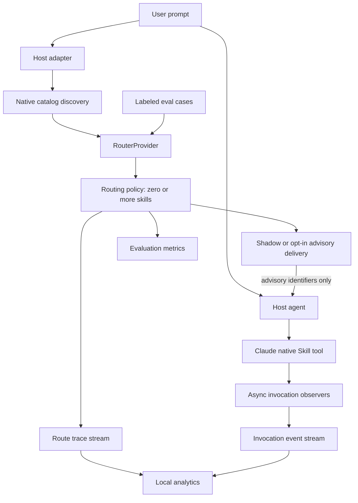

# Architecture

## System overview

SkillDispatch separates catalog eligibility, routing, host delivery and observation.
It supports Claude Code and Codex through adapters; Jev is the first real routing
provider. Routing recommendations do not prove native invocation or task quality.

Shadow records recommendations without adding context. Claude advisory supplies
same-turn native skill identifiers through a synchronous hook. Invocation observers
record positive evidence from Claude model Skill calls in a separate stream.

## Dependency direction

`cli` composes `runtime`, `config`, `discovery`, `providers`, `hooks`, `registration`,
`ops`, `eval`, `telemetry` and `observability`. Core depends only on domain types,
ordering/policy helpers and the SDK-independent provider contract. It imports no
host adapter or Jev SDK. Host-specific catalog metadata stays in discovery adapters.

The shared hook runtime calls core routing; adapters parse host inputs, and the
Claude advisory builder projects safe native identifiers. The invocation observer
has its own parser/runtime and never calls a routing provider. Pure analytics and
privacy projections are separate from CLI formatting and JSONL I/O.

## Core domain

The actual types in `src/core/types.ts` and `src/providers/types.ts` are:

| Type | Responsibility |
|---|---|
| `SkillDescriptor` | Catalog identity, name/description, local path, agent/scope, eligibility, metadata and content hash |
| `RoutingCandidate` | Only ID, name, description, agent and scope; no body or arbitrary metadata |
| `RouteRequest` | Prompt, cwd, requesting agent and discovered skills |
| `SkillDecision` | Per-skill probability and policy selection flag |
| `RouteResult` | Selected/all decisions, provider/model/latency, policy and diagnostics |
| `RoutingPolicy` | Inclusive threshold and maximum selection count |

`enabled` means eligible for automatic routing, not necessarily available for
explicit user invocation. Discovery results retain disabled skills where useful.
Domain diagnostics may contain local details; eval/trace/observer outputs use
explicit safe projections instead of serializing arbitrary diagnostics.

## Discovery

Adapters implement `discover(context)` and return skills plus diagnostics. The
filesystem helpers find the nearest Git boundary, canonicalize targets and bound
traversal. Outside a Git repository, only cwd is a project source. Scanning never
executes skill/plugin code or resolves arbitrary body includes.

### Claude Code

The adapter reads local state under `CLAUDE_CONFIG_DIR` (default `~/.claude`):

- Personal `skills/` and project `.claude/skills/` from cwd to the repository root.
- Explicit `skills/synced/<sync-directory>/<skill>/SKILL.md` sources.
- Installed and enabled plugins resolved from version-2 `installed_plugins.json`.
- Documented file-managed settings and enterprise skill roots, read-only.

`CLAUDE_CODE_PLUGIN_CACHE_DIR` replaces the plugins parent. Plugin discovery uses
applicable installation records and installed roots; it never scans marketplace
skill trees wholesale. A registered marketplace definition can supply a plugin's
components/defaults, but does not make uninstalled plugins active.

`enabledPlugins` merges per key from user → project → local → file-managed settings.
Explicit values override marketplace `defaultEnabled`, then installed-manifest
`defaultEnabled` (default true). Project/local installation records must apply to
the current project. Invalid or ambiguous authoritative state is conservative.

Two settings have special rules: `syncClaudeAiSkills: false` is a restrictive
opt-out from user/local/managed sources; shared project settings cannot disable
syncing, and true never reverses a false. `strictPluginOnlyCustomization` is
managed-only: true or an array containing `skills` locks that surface. Plugin and
managed skills remain eligible; local skills remain visible but disabled, and
synced skills are not loaded. Other surface names and non-managed copies are ignored.
Manual-only and `skillOverrides` restrictions still apply where supported.

Origin (`local-user`, `local-project`, `synced`, `plugin`, `managed`, `unknown`) is
separate from generic scope. `metadata.claude` carries adapter-owned native identity
and model eligibility. Local/managed invocation names come from the skill directory;
synced names use `anthropic-skills:<skill>`. Plugin names use the manifest namespace
and the skill's frontmatter name, falling back to its directory name. Unsafe names
are never advisory identifiers.

Canonical aliases are deduplicated. Distinct same-name local skills remain visible;
the advisory builder omits ambiguous native mappings rather than guessing a winner.
Duplicate synced names across account/cache directories are non-routable because
local files do not establish the active account; identical versions can collapse.
Plugin namespaces distinguish otherwise equal display names.

Native behavior and scope definitions are documented in the official
[skills reference](https://code.claude.com/docs/en/skills),
[configuration directory](https://code.claude.com/docs/en/claude-directory),
[plugin reference](https://code.claude.com/docs/en/plugins-reference), and
[settings precedence](https://code.claude.com/docs/en/settings).
Implementation coverage and special-policy details are in
[operations](OPERATIONS.md#discovery-behavior-and-current-host-differences).

### Codex

Codex adds CODEX_HOME `skills/` and `.system` to project/user `.agents/skills`,
trusted legacy project `.codex/skills`, admin and explicitly supplied roots.
Configured enabled plugins resolve known installation roots; caches alone confer no
eligibility. Native manifest namespaces, per-path/per-name user selectors and
implicit policy stay adapter-owned. Ambiguous versions, unsupported profiles and
policy failures are conservative. Session availability remains unconfirmed.
See [Codex contract, source references and limitations](CODEX.md).

### Native catalog identity and fingerprint

Local skill IDs hash the agent and canonical path. Synced/plugin IDs use logical
source identity and content, avoiding cache paths and sync account-directory names.
Content hashes cover the original skill text. Renaming a local skill can change its
ID; moving a logically identical plugin cache need not.

The catalog fingerprint hashes a sorted multiset of agent, scope, normalized name,
content hash, enabled state and optional adapter-owned `catalogIdentity` digest.
The Claude digest includes origin, native name, plugin identity/version/scope and
model eligibility. Paths are excluded and duplicate multiplicity is retained.
Ordering does not affect the hash; content, version or eligibility changes do.

## Router providers

### RouterProvider

`RouterProvider.judge(input)` receives the prompt, cwd, requesting agent, sorted
eligible candidates and an abort signal. `ProviderRouteOutput` has a required
`completeness` field:

- `complete`: exactly one decision per candidate and no failed IDs.
- `partial`: successful decisions and `failedSkillIds` partition all candidates;
  at least one failed ID is required. An all-failed partial is valid.
- Missing, unknown, duplicate or overlapping IDs, invalid probabilities or malformed
  diagnostics invalidate the entire response. No scores are invented.

Core validates provider output as untrusted data. Exceptions, deadline expiry and
invalid output produce safe diagnostics and empty recommendations. Partial results
retain successful decisions. Providers must honor cancellation and return before
the overall deadline to retain successes.

### Jev provider

The TypeSafe SDK is isolated behind an injectable call boundary. One independent
Noul judgment is made per candidate; `noul` maps directly to probability, not Choice
confidence. Candidates are chunked in stable order with bounded concurrency.
Defaults: model `jev-latest`, chunk size 48, concurrency 2, request timeout 1800 ms,
zero retries. Chunk size 48 and concurrency 8 are local safety ceilings, not
upstream API limits; configurable retries are limited to 0–2.

Only raw prompt text, requesting agent and candidate name/description/agent/scope
enter the API request. The provider omits cwd, IDs, local paths, arbitrary metadata
and skill bodies. SDK errors are replaced by fixed diagnostics; logging and endpoint
environment overrides are disabled. Response buffering protects the Node 20 SDK
stream/cancellation boundary. See [TypeSafe Noul](https://docs.typesafe.ai/primitives/noul)
and the [SDK](https://github.com/typesafe-ai/typesafe-sdk-js).

Independent judgments can select overlapping/broad skills together. This algorithm
is a baseline to evaluate, not a claim of superiority or calibrated thresholds.

### Mock provider

The deterministic mock supports explicit ID/name scores and a default probability.
Without fixtures it uses simple token overlap. It is for offline plumbing tests and
demos, not semantic accuracy measurement; failures never silently switch to mock.

## Routing policy

The default policy selects `probability >= 0.75`, at most four skills, ordered by
probability descending and then locale-independent name/ID. Zero selected skills
is a normal result. The overall route timeout defaults to 2500 ms.

Trace outcome is derived from routing diagnostics: normal results are `complete`,
`provider_partial` is `partial`, and provider/setup errors, timeouts or invalid
responses are `failed`. Failed/partial routing is still measurable but never
produces advisory context. No reranker, prefilter or automatic threshold tuning is
implemented.

## Host integration

### Shadow

Host adapters accept bounded UserPromptSubmit JSON, validate required/known fields
and ignore unknown additions. They use host cwd for single-agent discovery and never
read transcript files. Shadow returns no context or stdout and exits successfully.
Codex shadow remains async. Supported Codex advisory requires synchronous registration
and a user-declared contract; see [Codex integration](CODEX.md).

### Claude advisory

Only user config can set `hook.modes.claude: advisory`. The installer reconciles
Claude's routing registration to sync; switching back to shadow restores async.
Status/doctor detect mismatches without editing settings. Hook runtime also checks
registration safety before delivery.

Complete routing with selected, safely invocable skills can emit official
UserPromptSubmit JSON `hookSpecificOutput.additionalContext`. The builder preserves
policy order, excludes manual-only/ambiguous/unsafe identifiers and limits context
to 4096 UTF-8 bytes without splitting an identifier. It emits a concise optional
recommendation with user request priority, never paths, descriptions, probabilities,
prompt text or full skill bodies. The native Skill tool loads instructions when
Claude chooses to invoke it. Selected and injected IDs are recorded separately.

The [Claude hooks reference](https://code.claude.com/docs/en/hooks) describes
same-turn synchronous output and async lifecycle limits. Sync advisory adds routing
latency to the user's prompt; it does not extend the routing timeout.

### Fail-open behavior and registration

Dedicated CLI hooks bound stdin to 1 MiB/one second and the process to four seconds.
Setup/config/provider/storage errors preserve host continuation. A failed trace
write does not discard an otherwise safe advisory. There is no blocking decision.

Registration management is user-scope only, using absolute quoted Node/CLI commands.
It preserves unrelated settings and hooks, refuses malformed/linked/conflicting
files, keeps the first private backup, and writes via a same-directory temporary
file plus rename. Dry-run writes nothing. Codex inline hooks conflict with automatic
hooks.json installation; manual resolution is required. No host trust is auto-approved.
See [operational setup](OPERATIONS.md#hook-registration-and-modes).

## Observability

### Versioned route traces

[Route Trace v1](../schemas/route-trace.schema.json) records timestamp/UUID, host,
mode, prompt storage policy, catalog fingerprint/counts, provider/model/latency,
policy, outcome, scored decisions and safe diagnostic codes/levels/IDs. Optional
`delivery` distinguishes selected recommendations from emitted Claude advisory IDs.
Optional origins/catalog identities support native catalog comparison.

`capabilities.skillInvocationTelemetry: true` means observer registration and local
persistence prerequisites were detected at routing time. It does not establish
active-session reload, event delivery or observation completeness. Records without
optional delivery/capability data remain readable.

### Invocation event stream

Claude's `PreToolUse`, `PostToolUse` and `PostToolUseFailure`, matcher `Skill`, run
async observers with empty stdout and no host decisions. They append separate
[invocation events](../schemas/skill-invocation.schema.json), never mutate route
traces and never call Jev. The parser reads only the safe `tool_input.skill`
identifier, ignoring arguments, responses and raw errors. The identifier field is
also used in Anthropic's [skill evaluator source](https://github.com/anthropics/skills/blob/main/skills/skill-creator/scripts/run_eval.py).

Phases are attempted, succeeded and failed. Attempted means a model call reached
PreToolUse; success means native tool completion. Missing terminal events are
unknown. Unknown catalog names remain unresolved events; only exact native-name
matches add path-free catalog metadata. `agent_id` presence records a subagent
marker, not its ID or any routing action. Direct user slash invocation is excluded.

### Codex instruction-read stream

Codex's supported hooks expose normalized Bash commands, not a native Skill tool.
The observer recognizes only a single literal absolute `cat` read of SKILL.md,
then performs targeted catalog lookup. It never executes commands. Relative paths,
partial reads, dynamic syntax and nested wrappers are not evidence. Output text
cannot prove exit code or completeness, so a Post records `terminal-observed` with
unknown outcome. Names, logical identity and current content hash are projected;
commands, paths, responses and raw IDs are discarded.

The independent [Codex read schema](../schemas/codex-instruction-read.schema.json)
and [Codex route v2 schema](../schemas/route-trace-next.schema.json) preserve the
published Claude/v1 schemas. New readers accept v1/v2 and separately report unsupported
versions. CLI JSON envelope version 2 exposes evidence-specific fields. Old CLIs do
not understand the new records. No file is migrated or rewritten.

### Correlation and positive evidence

Installation-key HMACs share session/prompt domains between route and observer.
`prompt.hash` identifies text content; `host.promptKey` identifies a host submission
(Codex turn ID or Claude prompt ID). Tool-use keys are session-scoped and use a
separate domain. Missing host IDs are not reconstructed from transcripts.

Analytics joins lifecycle phases independent of JSONL append order and deduplicates
same-tool/same-phase events deterministically. Conflicting lifecycle evidence is
unknown. Observed adoption counts use configured Claude advisory route × logical
skill-version pairs and require exact session/prompt/catalog/content correlation.
Only resolved main-context attempted events credit main-turn recommendations;
success requires an observed terminal success for that attempted lifecycle.
Repeated calls of one skill count once per route pair.

Recommended ≠ injected ≠ observed model-invoked ≠ observed succeeded. Async absence
is never negative evidence. Old records without the capability marker are excluded
from adoption counts, not counted as non-use. Uncorrelatable records remain explicit.
No exact conversion/success percentage is reported. Stream-health facts are separate
from the filtered route cohort; [operations](OPERATIONS.md#claude-model-skill-invocation-telemetry)
defines the JSON fields and CLI views.

## Evaluation

The eval layer parses strict versioned YAML, resolves portable name/agent/scope
selectors to exactly one discovered skill, and evaluates cases sequentially using
one catalog snapshot. It reuses routing policy/provider/timeout; no labels reach the
provider. Partial labels leave unspecified skills unknown. Fully labeled cases make
all other skills negative and permit exact-set accuracy.

Metrics micro-aggregate TP/FP/FN into labeled precision, recall and F1, with null
for zero denominators. Exact-set accuracy uses fully labeled cases only. Latency
uses nearest-rank P50/P95; average selection and provider partial/failure counts
are separate. Failures stay in quality metrics. Precision/recall gates are explicit;
there is no reliability gate. Output omits raw prompts and local paths.
See [the format and formulas](OPERATIONS.md#routing-evaluation).

## Storage and privacy

Default private local storage is `~/.local/share/skilldispatch`, overridable through
`SKILLDISPATCH_DATA_DIR` or `XDG_DATA_HOME`. A race-safe 32-byte random installation
key supports HMAC-SHA256. Prompt persistence is hash by default, none or explicit raw
opt-in; the API credential is never a hash key. There is no telemetry upload.

JSONL writers use one append per event, private permissions and safe-file checks.
Invocation events have a 16 KiB append bound. Readers stream a starting-size snapshot
with a 2 MiB line bound, isolate corrupt lines and reject unsafe destinations/links.
Keys and streams cannot alias each other. POSIX ownership/0700 directories/0600 files
are checked where supported. Writes are best effort, not a durable audit guarantee.

Trace CLI projections never print prompt text/hashes, host correlation keys, tool
arguments/responses or raw diagnostics. Discovery and registration inspection can
show local paths; those outputs need review before sharing. Analytics memory grows
with unique skill versions, latency values and invocation lifecycles, not whole
raw trace bodies. There is no retention daemon or persistent index.

## Security and trust boundaries

Ordinary commands layer defaults → user → project → explicit config. Hooks skip
project SkillDispatch config unless the user opts in; reading project skills is
independent of config trust. Hook modes remain user-owned even with that opt-in.
Observers use user configuration only. Managed host policy remains authoritative.

Raw prompt text and minimal skill descriptions are sent to TypeSafe for real Jev
routing. Local hashing does not redact this request. Users must accept that data
boundary before routing sensitive material. Filesystem metadata is untrusted data,
not executable instructions for discovery. See [SECURITY_MODEL](SECURITY_MODEL.md)
and [security reporting](../SECURITY.md) for scope and limitations.

## Public library boundary

The package exposes one ESM root entry in `src/index.ts`: existing domain/provider
contracts, discovery adapters/parser, policy/route, eval runner/schema helpers and
selected trace helpers. Internal registration, observer, CLI and analytics modules
are not exported as separate package subpaths. Keep exports deliberate and preserve
existing config, trace and library compatibility. CLI is the primary user interface;
see [a library example](OPERATIONS.md#library-and-architecture).

## Known architectural limitations

The local catalog cannot certify live host state, trust, account selection, session
settings, lazy/bundled skills or host reload. Advisory adds latency and depends on a supported host contract.
Observers are async positive evidence, not complete turn coverage or task-quality
measurement. Codex read attempts do not prove complete loading, successful execution
or native invocation. There is no direct-user slash telemetry,
subagent routing, transcript scraping, cloud upload or automatic tuning. Public
eval fixtures are synthetic drafts and do not establish better-than-native routing.
